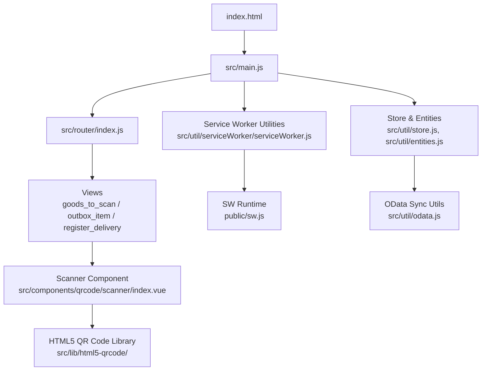
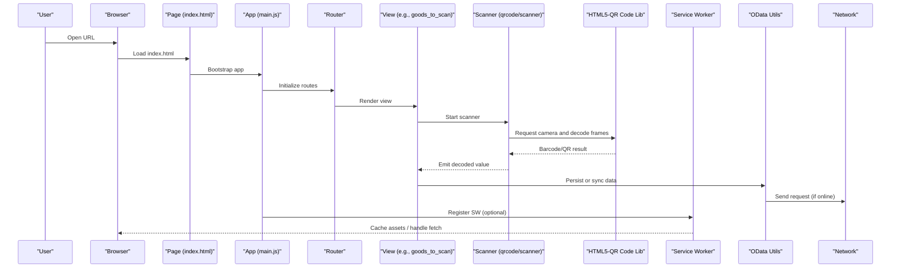
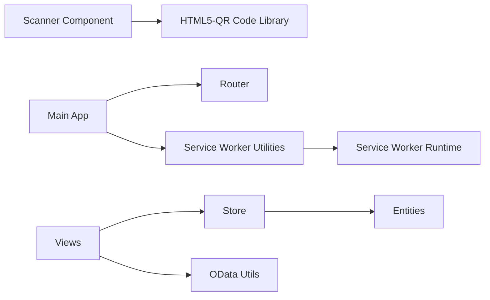

# Troubleshooting & FAQ

<cite>
**Referenced Files in This Document**
- [README.md](file://README.md)
- [index.html](file://index.html)
- [vite.config.js](file://vite.config.js)
- [src/main.js](file://src/main.js)
- [src/router/index.js](file://src/router/index.js)
- [src/util/serviceWorker/serviceWorker.js](file://src/util/serviceWorker/serviceWorker.js)
- [public/sw.js](file://public/sw.js)
- [public/mock-sw.js](file://public/mock-sw.js)
- [src/components/qrcode/scanner/index.vue](file://src/components/qrcode/scanner/index.vue)
- [src/lib/html5-qrcode/](file://src/lib/html5-qrcode/)
- [src/views/goods_to_scan/index.vue](file://src/views/goods_to_scan/index.vue)
- [src/views/outbox_item/index.vue](file://src/views/outbox_item/index.vue)
- [src/views/register_delivery/index.vue](file://src/views/register_delivery/index.vue)
- [src/util/store.js](file://src/util/store.js)
- [src/util/odata.js](file://src/util/odata.js)
- [src/util/entities.js](file://src/util/entities.js)
- [error.html](file://error.html)
- [scripts/start.sh](file://scripts/start.sh)
- [scripts/restart.sh](file://scripts/restart.sh)
- [scripts/stop.sh](file://scripts/stop.sh)
- [scripts/watch.sh](file://scripts/watch.sh)
- [scripts/chrome.sh](file://scripts/chrome.sh)
- [scripts/push.sh](file://scripts/push.sh)
- [scripts/zip.sh](file://scripts/zip.sh)
</cite>

## Table of Contents
1. Introduction
2. Project Structure
3. Core Components
4. Architecture Overview
5. Detailed Component Analysis
6. Dependency Analysis
7. Performance Considerations
8. Troubleshooting Guide
9. Conclusion
10. Appendices

## Introduction
This document provides comprehensive troubleshooting guidance and frequently asked questions for ahm-gr-scanner, focusing on camera permission problems, scanning performance issues, offline functionality, browser compatibility, mobile considerations, network connectivity, Service Worker debugging, memory leaks, performance bottlenecks, user errors, data synchronization, and deployment issues. It is intended for developers and operators who need to diagnose and resolve common operational problems quickly.

## Project Structure
The application is a Vue-based web app with optional Service Worker support and barcode/QR scanning components. Key areas relevant to troubleshooting include:
- Entry points and routing
- Scanning UI and library integration
- Service Worker registration and caching
- Data persistence and OData sync utilities
- Build and runtime scripts

**Diagram sources**
- [index.html](file://index.html)
- [src/main.js](file://src/main.js)
- [src/router/index.js](file://src/router/index.js)
- [src/components/qrcode/scanner/index.vue](file://src/components/qrcode/scanner/index.vue)
- [src/lib/html5-qrcode/](file://src/lib/html5-qrcode/)
- [src/util/serviceWorker/serviceWorker.js](file://src/util/serviceWorker/serviceWorker.js)
- [public/sw.js](file://public/sw.js)
- [src/util/store.js](file://src/util/store.js)
- [src/util/entities.js](file://src/util/entities.js)
- [src/util/odata.js](file://src/util/odata.js)

**Section sources**
- [README.md](file://README.md)
- [index.html](file://index.html)
- [vite.config.js](file://vite.config.js)
- [src/main.js](file://src/main.js)
- [src/router/index.js](file://src/router/index.js)

## Core Components
- Scanner component: Provides the camera feed and decoding logic via an integrated HTML5 QR code library.
- Service Worker utilities: Register and manage SW lifecycle and cache strategies.
- Store and entities: Local state management and entity definitions used across views.
- OData utilities: Helpers for syncing data with remote services.
- Views: Pages that orchestrate scanning workflows and data submission.

**Section sources**
- [src/components/qrcode/scanner/index.vue](file://src/components/qrcode/scanner/index.vue)
- [src/lib/html5-qrcode/](file://src/lib/html5-qrcode/)
- [src/util/serviceWorker/serviceWorker.js](file://src/util/serviceWorker/serviceWorker.js)
- [public/sw.js](file://public/sw.js)
- [src/util/store.js](file://src/util/store.js)
- [src/util/entities.js](file://src/util/entities.js)
- [src/util/odata.js](file://src/util/odata.js)
- [src/views/goods_to_scan/index.vue](file://src/views/goods_to_scan/index.vue)
- [src/views/outbox_item/index.vue](file://src/views/outbox_item/index.vue)
- [src/views/register_delivery/index.vue](file://src/views/register_delivery/index.vue)

## Architecture Overview
High-level flow from page load to scanning and data operations:

**Diagram sources**
- [index.html](file://index.html)
- [src/main.js](file://src/main.js)
- [src/router/index.js](file://src/router/index.js)
- [src/views/goods_to_scan/index.vue](file://src/views/goods_to_scan/index.vue)
- [src/components/qrcode/scanner/index.vue](file://src/components/qrcode/scanner/index.vue)
- [src/lib/html5-qrcode/](file://src/lib/html5-qrcode/)
- [src/util/serviceWorker/serviceWorker.js](file://src/util/serviceWorker/serviceWorker.js)
- [public/sw.js](file://public/sw.js)
- [src/util/odata.js](file://src/util/odata.js)

## Detailed Component Analysis

### Camera Permission and Scanning Issues
Common symptoms:
- Camera prompt not shown or denied
- Black screen or no video feed
- Slow frame processing or high CPU usage
- Inconsistent results on mobile devices

Root causes and checks:
- HTTPS requirement: Many browsers require secure context for camera access. Ensure the site is served over HTTPS or localhost during development.
- Permissions: Verify the user granted camera permissions; check if they previously denied access and need to reset permissions in browser settings.
- Device constraints: Some devices lack cameras or have limited capabilities; confirm device hardware and OS version.
- Resource contention: Other apps or tabs may be using the camera; close them before retrying.
- Library configuration: Review scanner initialization parameters (resolution, facing mode, format filters) to match device capabilities.

Troubleshooting steps:
- Confirm secure context and correct origin.
- Reset camera permissions in browser settings and reload.
- Test on multiple devices/browsers to isolate device-specific issues.
- Reduce resolution or change facing mode if performance is poor.
- Inspect console for media-related errors and warnings.

**Section sources**
- [src/components/qrcode/scanner/index.vue](file://src/components/qrcode/scanner/index.vue)
- [src/lib/html5-qrcode/](file://src/lib/html5-qrcode/)
- [src/views/goods_to_scan/index.vue](file://src/views/goods_to_scan/index.vue)

### Offline Functionality and Service Worker Problems
Symptoms:
- App fails to load when offline
- Assets not cached or stale content served
- Background sync or push notifications not working

Checks:
- Service Worker registration: Ensure SW is registered and active.
- Cache strategy: Validate which resources are cached and how updates are handled.
- Network fallbacks: Confirm offline pages or fallback responses are configured.
- Development vs production: Mock SW behavior may differ from production SW.

Debugging techniques:
- Use browser DevTools Application tab to inspect SW status, caches, and network interception.
- Toggle offline mode and verify expected behavior.
- Compare mock SW behavior with production SW.

**Section sources**
- [src/util/serviceWorker/serviceWorker.js](file://src/util/serviceWorker/serviceWorker.js)
- [public/sw.js](file://public/sw.js)
- [public/mock-sw.js](file://public/mock-sw.js)

### Browser Compatibility and Mobile Considerations
Issues:
- Missing features in older browsers
- Mobile-specific camera behaviors (orientation, autofocus)
- Touch interactions and viewport scaling

Guidance:
- Target modern browsers that support required APIs (camera, Service Worker).
- Provide graceful degradation for unsupported environments.
- Test on real mobile devices; emulators may not reflect camera behavior accurately.
- Adjust UI for small screens and touch targets.

**Section sources**
- [index.html](file://index.html)
- [vite.config.js](file://vite.config.js)
- [src/components/qrcode/scanner/index.vue](file://src/components/qrcode/scanner/index.vue)

### Network Connectivity and Data Synchronization
Symptoms:
- Requests fail or time out
- Outbox items not synced
- Conflicting updates between client and server

Checks:
- Endpoint availability and CORS policies.
- Authentication headers and tokens.
- Retry/backoff strategies and error handling.
- Local store consistency and conflict resolution.

Troubleshooting steps:
- Inspect network requests and responses in DevTools.
- Validate credentials and token refresh flows.
- Check local storage and outbox queues for pending items.
- Reproduce with minimal payloads to isolate issues.

**Section sources**
- [src/util/odata.js](file://src/util/odata.js)
- [src/util/store.js](file://src/util/store.js)
- [src/views/outbox_item/index.vue](file://src/views/outbox_item/index.vue)
- [src/views/register_delivery/index.vue](file://src/views/register_delivery/index.vue)

### Memory Leaks and Performance Bottlenecks
Symptoms:
- Increasing memory usage over time
- Frame drops or sluggish scanning
- High CPU usage during long sessions

Investigation:
- Monitor heap snapshots and timeline recordings in DevTools.
- Identify lingering event listeners, timers, or references to large objects.
- Ensure scanner streams are stopped when navigating away.
- Debounce heavy operations and avoid unnecessary re-renders.

Optimization tips:
- Limit image/frame sizes and processing frequency.
- Reuse buffers and avoid allocations in hot paths.
- Offload heavy work to Web Workers if applicable.

**Section sources**
- [src/components/qrcode/scanner/index.vue](file://src/components/qrcode/scanner/index.vue)
- [src/lib/html5-qrcode/](file://src/lib/html5-qrcode/)
- [src/util/store.js](file://src/util/store.js)

## Dependency Analysis
Key dependencies and their roles:
- HTML5 QR Code library: Decodes barcodes/QR codes from camera frames.
- Service Worker runtime: Manages caching and offline behavior.
- OData utilities: Handle remote data operations.
- Store and entities: Maintain local state and schema.

**Diagram sources**
- [src/components/qrcode/scanner/index.vue](file://src/components/qrcode/scanner/index.vue)
- [src/lib/html5-qrcode/](file://src/lib/html5-qrcode/)
- [src/util/serviceWorker/serviceWorker.js](file://src/util/serviceWorker/serviceWorker.js)
- [public/sw.js](file://public/sw.js)
- [src/util/store.js](file://src/util/store.js)
- [src/util/entities.js](file://src/util/entities.js)
- [src/util/odata.js](file://src/util/odata.js)
- [src/router/index.js](file://src/router/index.js)

**Section sources**
- [src/router/index.js](file://src/router/index.js)
- [src/util/serviceWorker/serviceWorker.js](file://src/util/serviceWorker/serviceWorker.js)
- [public/sw.js](file://public/sw.js)
- [src/util/odata.js](file://src/util/odata.js)
- [src/util/store.js](file://src/util/store.js)
- [src/util/entities.js](file://src/util/entities.js)

## Performance Considerations
- Prefer HTTPS and efficient asset delivery to reduce latency.
- Tune scanner resolution and frame rate based on device capability.
- Implement debouncing and throttling for frequent events.
- Use caching strategically to minimize redundant network calls.
- Profile with DevTools to identify bottlenecks and memory growth.

[No sources needed since this section provides general guidance]

## Troubleshooting Guide

### Camera Permission Problems
- Ensure the app is served over HTTPS or localhost.
- Reset camera permissions in browser settings and reload.
- Close other applications using the camera.
- Test on different devices and browsers to isolate issues.
- Inspect console for media permission errors.

**Section sources**
- [src/components/qrcode/scanner/index.vue](file://src/components/qrcode/scanner/index.vue)
- [src/lib/html5-qrcode/](file://src/lib/html5-qrcode/)

### Scanning Performance Issues
- Lower camera resolution or switch facing mode.
- Avoid concurrent heavy tasks while scanning.
- Stop scanner streams when leaving the page.
- Profile CPU and memory usage; remove unnecessary listeners.

**Section sources**
- [src/components/qrcode/scanner/index.vue](file://src/components/qrcode/scanner/index.vue)
- [src/lib/html5-qrcode/](file://src/lib/html5-qrcode/)

### Offline Functionality Problems
- Verify Service Worker registration and activation.
- Check cache contents and update strategies.
- Compare mock SW behavior with production SW.
- Test offline loading and fallback pages.

**Section sources**
- [src/util/serviceWorker/serviceWorker.js](file://src/util/serviceWorker/serviceWorker.js)
- [public/sw.js](file://public/sw.js)
- [public/mock-sw.js](file://public/mock-sw.js)

### Browser Compatibility and Mobile Considerations
- Confirm target browsers support required APIs.
- Provide fallbacks for unsupported environments.
- Test on real mobile devices; validate orientation and touch UX.

**Section sources**
- [index.html](file://index.html)
- [vite.config.js](file://vite.config.js)
- [src/components/qrcode/scanner/index.vue](file://src/components/qrcode/scanner/index.vue)

### Network Connectivity Troubleshooting
- Validate endpoints, CORS, and authentication.
- Inspect network requests and responses.
- Check outbox queue and retry mechanisms.
- Reproduce with minimal payloads.

**Section sources**
- [src/util/odata.js](file://src/util/odata.js)
- [src/util/store.js](file://src/util/store.js)
- [src/views/outbox_item/index.vue](file://src/views/outbox_item/index.vue)

### Debugging Service Worker Issues
- Use DevTools Application tab to inspect SW status and caches.
- Force update and clear caches to test new versions.
- Log SW events and fetch interceptors for diagnostics.

**Section sources**
- [src/util/serviceWorker/serviceWorker.js](file://src/util/serviceWorker/serviceWorker.js)
- [public/sw.js](file://public/sw.js)

### Memory Leaks and Performance Bottlenecks
- Take heap snapshots and compare over time.
- Remove event listeners and timers on cleanup.
- Optimize rendering and avoid large object retention.

**Section sources**
- [src/components/qrcode/scanner/index.vue](file://src/components/qrcode/scanner/index.vue)
- [src/util/store.js](file://src/util/store.js)

### Common User Errors
- Denied camera permissions: guide users to reset permissions.
- Incorrect scan distance/lighting: provide tips for better scans.
- Misconfigured endpoints: verify URLs and credentials.

**Section sources**
- [src/components/qrcode/scanner/index.vue](file://src/components/qrcode/scanner/index.vue)
- [src/util/odata.js](file://src/util/odata.js)

### Data Synchronization Problems
- Check local store integrity and entity schemas.
- Resolve conflicts and ensure idempotent operations.
- Monitor outbox items until successfully synced.

**Section sources**
- [src/util/store.js](file://src/util/store.js)
- [src/util/entities.js](file://src/util/entities.js)
- [src/views/outbox_item/index.vue](file://src/views/outbox_item/index.vue)

### Deployment Issues
- Ensure HTTPS for camera and Service Worker features.
- Validate build outputs and asset paths.
- Confirm environment variables and backend connectivity.

**Section sources**
- [index.html](file://index.html)
- [vite.config.js](file://vite.config.js)
- [scripts/start.sh](file://scripts/start.sh)
- [scripts/restart.sh](file://scripts/restart.sh)
- [scripts/stop.sh](file://scripts/stop.sh)
- [scripts/watch.sh](file://scripts/watch.sh)
- [scripts/chrome.sh](file://scripts/chrome.sh)
- [scripts/push.sh](file://scripts/push.sh)
- [scripts/zip.sh](file://scripts/zip.sh)

## Conclusion
By systematically checking permissions, network conditions, Service Worker behavior, and performance metrics, most issues in ahm-gr-scanner can be identified and resolved efficiently. Use the provided diagrams and section sources to trace flows and locate relevant code for deeper investigation.

[No sources needed since this section summarizes without analyzing specific files]

## Appendices

### Frequently Asked Questions

- How do I enable camera access?
  - Serve over HTTPS or localhost and grant camera permissions in browser settings.

- Why does scanning lag on mobile?
  - Reduce resolution/facing mode, stop unused streams, and profile CPU/memory.

- How can I make the app work offline?
  - Register and configure the Service Worker; cache essential assets and implement fallbacks.

- What browsers are supported?
  - Modern browsers with camera and Service Worker support; provide graceful degradation for older ones.

- How do I debug Service Worker issues?
  - Use DevTools Application tab to inspect SW status, caches, and network interception.

- How do I troubleshoot data sync failures?
  - Inspect network requests, validate credentials, and review outbox queue and retry logic.

- How do I deploy securely?
  - Ensure HTTPS, correct asset paths, and backend connectivity; use provided scripts to start and manage the server.

**Section sources**
- [src/components/qrcode/scanner/index.vue](file://src/components/qrcode/scanner/index.vue)
- [src/util/serviceWorker/serviceWorker.js](file://src/util/serviceWorker/serviceWorker.js)
- [public/sw.js](file://public/sw.js)
- [src/util/odata.js](file://src/util/odata.js)
- [src/views/outbox_item/index.vue](file://src/views/outbox_item/index.vue)
- [index.html](file://index.html)
- [vite.config.js](file://vite.config.js)
- [scripts/start.sh](file://scripts/start.sh)
- [scripts/restart.sh](file://scripts/restart.sh)
- [scripts/stop.sh](file://scripts/stop.sh)
- [scripts/watch.sh](file://scripts/watch.sh)
- [scripts/chrome.sh](file://scripts/chrome.sh)
- [scripts/push.sh](file://scripts/push.sh)
- [scripts/zip.sh](file://scripts/zip.sh)