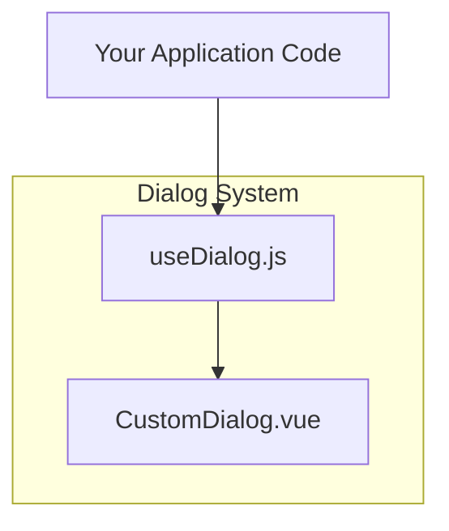
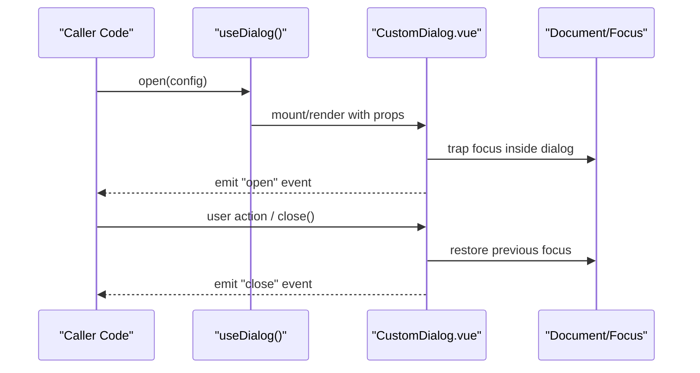
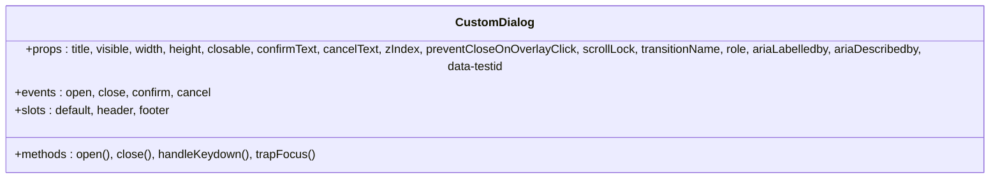
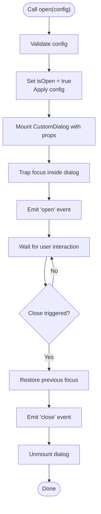
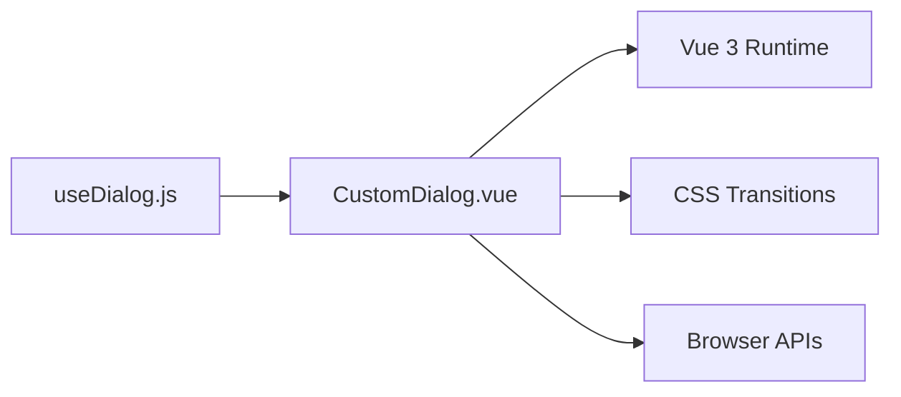

# Dialog System

<cite>
**Referenced Files in This Document**
- [CustomDialog.vue](file://src/components/dialog/CustomDialog.vue)
- [useDialog.js](file://src/components/dialog/useDialog.js)
- [README.md](file://src/components/dialog/README.md)
</cite>

## Table of Contents
1. [Introduction](#introduction)
2. [Project Structure](#project-structure)
3. [Core Components](#core-components)
4. [Architecture Overview](#architecture-overview)
5. [Detailed Component Analysis](#detailed-component-analysis)
6. [Dependency Analysis](#dependency-analysis)
7. [Performance Considerations](#performance-considerations)
8. [Troubleshooting Guide](#troubleshooting-guide)
9. [Conclusion](#conclusion)

## Introduction
This document describes the dialog system component, focusing on:
- CustomDialog component: props, events, slots, and configuration options
- useDialog composable: programmatic dialog management API
- Usage examples for common dialog patterns (confirmation, alert, custom content)
- Lifecycle, z-index management, keyboard navigation, and accessibility features
- Styling customization, responsive behavior, and integration patterns
- Troubleshooting guidance and performance optimization tips

The goal is to provide both a quick-start guide and an in-depth reference for developers integrating dialogs into their application.

## Project Structure
The dialog system is implemented under src/components/dialog with two primary files:
- CustomDialog.vue: The Vue component that renders the modal overlay, container, header/body/footer, and handles focus and keyboard interactions.
- useDialog.js: A composable that exposes a simple imperative API to open, close, and manage dialogs from anywhere in the app.

**Diagram sources**
- [CustomDialog.vue](file://src/components/dialog/CustomDialog.vue)
- [useDialog.js](file://src/components/dialog/useDialog.js)

**Section sources**
- [CustomDialog.vue](file://src/components/dialog/CustomDialog.vue)
- [useDialog.js](file://src/components/dialog/useDialog.js)

## Core Components
- CustomDialog.vue
  - Purpose: Renders a modal dialog with accessible markup, focus trapping, and keyboard handling.
  - Typical responsibilities:
    - Overlay and container rendering
    - Header/body/footer sections via slots
    - Focus management when opening/closing
    - Keyboard shortcuts (e.g., Escape to close)
    - Z-index stacking and positioning
    - Accessibility attributes (role, aria-*), focus restoration
- useDialog.js
  - Purpose: Provides a programmatic API to control dialogs without direct component references.
  - Typical responsibilities:
    - Open/close lifecycle methods
    - State synchronization between caller and component
    - Event emission forwarding
    - Optional configuration defaults

**Section sources**
- [CustomDialog.vue](file://src/components/dialog/CustomDialog.vue)
- [useDialog.js](file://src/components/dialog/useDialog.js)

## Architecture Overview
The dialog system follows a declarative + imperative hybrid pattern:
- Declarative usage: Render <CustomDialog> directly in templates and bind props/events/slots.
- Imperative usage: Call useDialog() to open/close dialogs programmatically, ideal for global flows or third-party integrations.

**Diagram sources**
- [useDialog.js](file://src/components/dialog/useDialog.js)
- [CustomDialog.vue](file://src/components/dialog/CustomDialog.vue)

## Detailed Component Analysis

### CustomDialog.vue
- Props
  - title: string — Dialog heading text
  - visible: boolean — Controls visibility
  - width: string | number — Width override (e.g., "400px", "50%")
  - height: string | number — Height override (e.g., "auto", "60vh")
  - closable: boolean — Whether to show a close button
  - confirmText: string — Primary action label
  - cancelText: string — Secondary action label
  - zIndex: number — Stacking context override
  - preventCloseOnOverlayClick: boolean — Disables closing by clicking outside
  - scrollLock: boolean — Locks body scroll while open
  - transitionName: string — CSS transition class name
  - role: string — ARIA role override (default "dialog")
  - ariaLabelledby: string — ID of element labeling the dialog
  - ariaDescribedby: string — ID of element describing the dialog
  - data-testid: string — Test selector
- Events
  - open: emitted when dialog becomes visible
  - close: emitted when dialog closes (via close button, overlay click if allowed, or Escape)
  - confirm: emitted when primary action is triggered
  - cancel: emitted when secondary action is triggered
- Slots
  - default: main content area
  - header: optional header section (overrides default header)
  - footer: optional footer section (overrides default footer)
- Behavior
  - Focus trap: Keeps focus within the dialog while open; restores focus on close
  - Keyboard: Escape closes unless prevented; Tab cycles through focusable elements
  - Overlay click: Closes unless preventCloseOnOverlayClick is true
  - Z-index: Managed internally; can be overridden via zIndex prop
  - Scroll lock: Prevents background scrolling when open
  - Transitions: Uses transitionName for enter/leave animations
  - Accessibility: Sets appropriate roles and aria attributes; ensures labels/descriptions are linked

**Diagram sources**
- [CustomDialog.vue](file://src/components/dialog/CustomDialog.vue)

**Section sources**
- [CustomDialog.vue](file://src/components/dialog/CustomDialog.vue)

### useDialog.js
- API surface
  - open(config): Opens a dialog with provided configuration
  - close(): Closes the currently open dialog
  - isOpen: Reactive flag indicating current visibility
  - config: Reactive configuration object (title, actions, etc.)
- Typical implementation details
  - Maintains internal state for visibility and configuration
  - Emits events to mirror component behavior
  - Integrates with focus management and keyboard handling
  - Supports chaining and composition across components

**Diagram sources**
- [useDialog.js](file://src/components/dialog/useDialog.js)
- [CustomDialog.vue](file://src/components/dialog/CustomDialog.vue)

**Section sources**
- [useDialog.js](file://src/components/dialog/useDialog.js)

### Usage Examples

- Confirmation dialog (declarative)
  - Bind visible to local state
  - Handle confirm/cancel events
  - Use slots for custom content
  - Reference: [CustomDialog.vue](file://src/components/dialog/CustomDialog.vue)

- Alert dialog (imperative)
  - Call useDialog().open({ title, message, actions })
  - Listen to open/close events
  - Reference: [useDialog.js](file://src/components/dialog/useDialog.js)

- Custom content dialog
  - Provide header/footer slots
  - Adjust width/height/zIndex as needed
  - Reference: [CustomDialog.vue](file://src/components/dialog/CustomDialog.vue)

For concrete code samples, see:
- [README.md](file://src/components/dialog/README.md)

**Section sources**
- [CustomDialog.vue](file://src/components/dialog/CustomDialog.vue)
- [useDialog.js](file://src/components/dialog/useDialog.js)
- [README.md](file://src/components/dialog/README.md)

## Dependency Analysis
- Internal dependencies
  - useDialog.js depends on CustomDialog.vue to render and manage the modal instance
  - CustomDialog.vue may depend on shared utilities for focus management and keyboard handling
- External dependencies
  - Vue 3 runtime for reactivity and component lifecycle
  - CSS transitions for open/close animations
  - Browser APIs for focus management and event handling

**Diagram sources**
- [useDialog.js](file://src/components/dialog/useDialog.js)
- [CustomDialog.vue](file://src/components/dialog/CustomDialog.vue)

**Section sources**
- [useDialog.js](file://src/components/dialog/useDialog.js)
- [CustomDialog.vue](file://src/components/dialog/CustomDialog.vue)

## Performance Considerations
- Lazy mounting: Only mount the dialog when visible to reduce initial render cost
- Transition optimization: Keep transition classes minimal; avoid heavy layout thrashing during enter/leave
- Focus management: Ensure focus trap is lightweight; avoid unnecessary reflows
- Event listeners: Attach/detach keyboard and overlay listeners only when necessary
- Memory leaks: Always clean up listeners and timers on unmount
- Re-rendering: Avoid large reactive payloads in props; pass stable references where possible

[No sources needed since this section provides general guidance]

## Troubleshooting Guide
- Dialog not closing on Escape
  - Verify keydown handler is attached and not prevented elsewhere
  - Check preventCloseOnOverlayClick and other flags
  - Reference: [CustomDialog.vue](file://src/components/dialog/CustomDialog.vue)

- Focus stuck outside dialog
  - Ensure focus trap is active and contains focusable elements
  - Confirm focus restoration on close
  - Reference: [CustomDialog.vue](file://src/components/dialog/CustomDialog.vue)

- Overlay click does not close
  - Confirm preventCloseOnOverlayClick is false
  - Check event propagation and z-index layering
  - Reference: [CustomDialog.vue](file://src/components/dialog/CustomDialog.vue)

- Z-index conflicts with other modals
  - Override zIndex prop or adjust stacking context in CSS
  - Reference: [CustomDialog.vue](file://src/components/dialog/CustomDialog.vue)

- Programmatic open/close not working
  - Ensure useDialog().open() is called with valid config
  - Check isOpen state and event bindings
  - Reference: [useDialog.js](file://src/components/dialog/useDialog.js)

- Accessibility issues
  - Provide aria-labelledby/aria-describedby IDs
  - Ensure role="dialog" and proper focus management
  - Reference: [CustomDialog.vue](file://src/components/dialog/CustomDialog.vue)

**Section sources**
- [CustomDialog.vue](file://src/components/dialog/CustomDialog.vue)
- [useDialog.js](file://src/components/dialog/useDialog.js)

## Conclusion
The dialog system combines a flexible declarative component with a concise imperative API. It emphasizes accessibility, keyboard navigation, and predictable lifecycle management. By following the guidelines and troubleshooting steps above, you can integrate dialogs consistently across your application while maintaining performance and usability.

[No sources needed since this section summarizes without analyzing specific files]