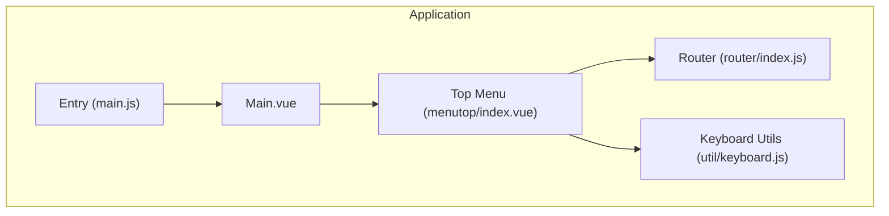
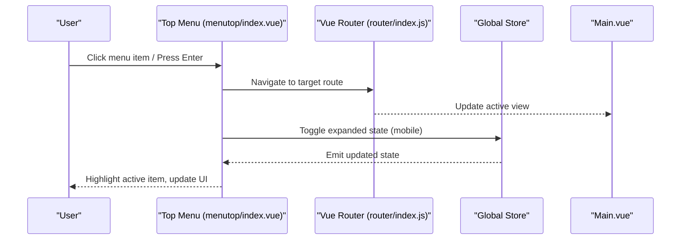
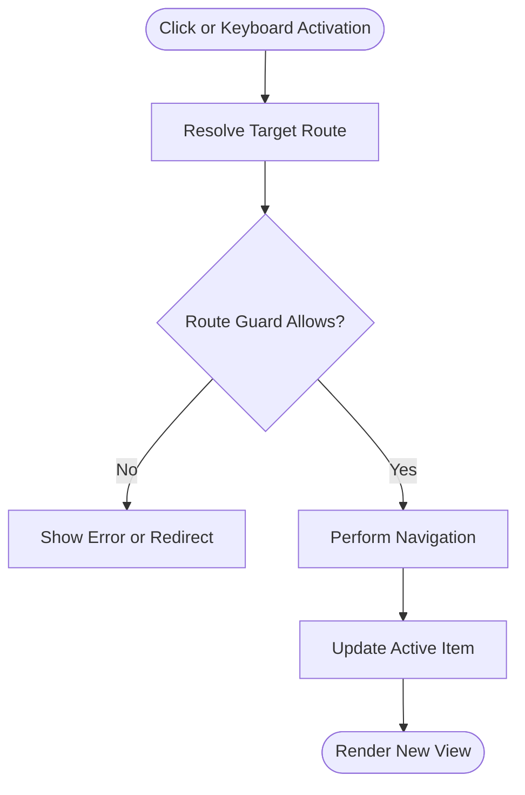
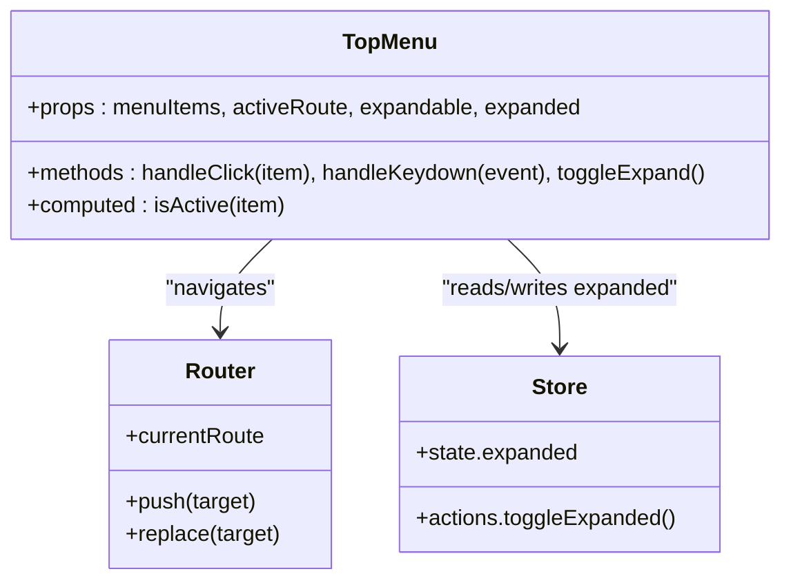
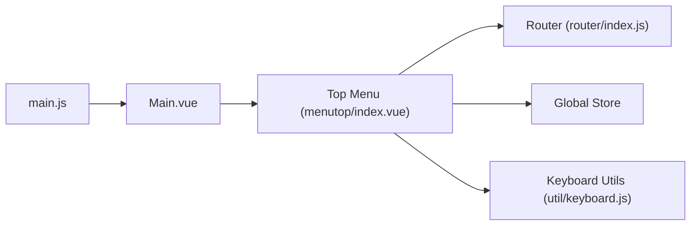

# Navigation Components

<cite>
**Referenced Files in This Document**
- [index.vue](file://src/components/menutop/index.vue)
- [index.js](file://src/router/index.js)
- [main.js](file://src/main.js)
- [Main.vue](file://src/Main.vue)
- [keyboard.js](file://src/util/keyboard.js)
</cite>

## Table of Contents
1. [Introduction](#introduction)
2. [Project Structure](#project-structure)
3. [Core Components](#core-components)
4. [Architecture Overview](#architecture-overview)
5. [Detailed Component Analysis](#detailed-component-analysis)
6. [Dependency Analysis](#dependency-analysis)
7. [Performance Considerations](#performance-considerations)
8. [Troubleshooting Guide](#troubleshooting-guide)
9. [Conclusion](#conclusion)
10. [Appendices](#appendices)

## Introduction
This document provides comprehensive documentation for the top menu navigation component used across the application. It explains how to configure menu items, manage active states, handle events, and integrate with Vue Router. It also covers responsive behavior on mobile devices, keyboard navigation, accessibility features, styling approaches, and performance considerations. The goal is to enable developers to implement consistent, accessible, and performant navigation experiences.

## Project Structure
The top menu navigation component resides under the components directory and integrates with the application’s router and global state. Key files involved include:
- Top menu component implementation
- Application router configuration
- Main application entry point
- Global layout where the menu is typically placed
- Keyboard utilities for navigation support

**Diagram sources**
- [Main.vue](file://src/Main.vue)
- [index.vue](file://src/components/menutop/index.vue)
- [index.js](file://src/router/index.js)
- [main.js](file://src/main.js)
- [keyboard.js](file://src/util/keyboard.js)

**Section sources**
- [index.vue](file://src/components/menutop/index.vue)
- [index.js](file://src/router/index.js)
- [main.js](file://src/main.js)
- [Main.vue](file://src/Main.vue)
- [keyboard.js](file://src/util/keyboard.js)

## Core Components
- Top Menu Component
  - Purpose: Renders a horizontal list of navigation links or actions, highlights the active route, and supports keyboard navigation and accessibility attributes.
  - Integration: Uses the application router to determine the current route and navigate between routes. May use global store for expanded/collapsed state on mobile.
  - Accessibility: Provides roles, aria attributes, focus management, and keyboard shortcuts for efficient navigation.

- Router Integration
  - Purpose: Defines named routes and guards that the menu uses to compute active states and navigate programmatically.
  - Active State: Derived from the current route path or name.

- Keyboard Utilities
  - Purpose: Centralized helpers for key handling, enabling consistent keyboard navigation patterns across components.

**Section sources**
- [index.vue](file://src/components/menutop/index.vue)
- [index.js](file://src/router/index.js)
- [keyboard.js](file://src/util/keyboard.js)

## Architecture Overview
The top menu navigates users by reading the current route and triggering navigation via the router. On mobile, it may toggle an expanded panel controlled by global state. Keyboard interactions are handled through utility functions to ensure consistent behavior.

**Diagram sources**
- [index.vue](file://src/components/menutop/index.vue)
- [index.js](file://src/router/index.js)
- [Main.vue](file://src/Main.vue)

## Detailed Component Analysis

### Props and Configuration
- menuItems
  - Type: Array
  - Description: List of menu entries. Each entry should define label, route target (path or name), optional icon, and metadata for accessibility.
  - Example fields: label, to (string or object), icon (optional), ariaLabel (optional).
- activeRoute
  - Type: String or Object
  - Description: Current route reference used to highlight the active menu item. If not provided, the component can derive it from the router.
- expandable
  - Type: Boolean
  - Description: Enables collapsible behavior for mobile layouts.
- expanded
  - Type: Boolean
  - Description: Controls whether the menu is expanded or collapsed. Often bound to global store.
- role and aria attributes
  - Type: String
  - Description: Optional overrides for accessibility labels and roles.

Usage examples:
- Basic static menu: Provide a fixed array of menuItems with to targets.
- Dynamic menu: Compute menuItems from store or API response; bind activeRoute to router.currentRoute.
- Collapsible mobile menu: Bind expandable and expanded to store state; render a toggle button.

**Section sources**
- [index.vue](file://src/components/menutop/index.vue)

### Active State Management
- Route-based highlighting
  - Derive active state from the current route path or name.
  - Compare each menu item’s target with the active route to apply active classes.
- Programmatic updates
  - When navigating, ensure the active class updates synchronously with route changes.
- External control
  - Accept activeRoute prop to override internal detection when needed (e.g., nested routing scenarios).

Best practices:
- Normalize route comparisons (handle trailing slashes and query parameters consistently).
- Debounce heavy computations if menuItems are large.

**Section sources**
- [index.vue](file://src/components/menutop/index.vue)
- [index.js](file://src/router/index.js)

### Event Handling
- Click handlers
  - Prevent default behavior if necessary and call router navigation methods.
  - Close expanded menus on mobile after selection.
- Keyboard handlers
  - Support Enter/Space to activate items.
  - Arrow keys to move focus within the menu when expanded.
  - Escape to collapse the menu on mobile.
- Focus management
  - Ensure focus moves to the next logical element after navigation or toggling.

Integration with keyboard utilities:
- Use centralized key listeners to avoid duplication and ensure consistent behavior.

**Section sources**
- [index.vue](file://src/components/menutop/index.vue)
- [keyboard.js](file://src/util/keyboard.js)

### Navigation Flow Integration with Vue Router
- Declarative vs programmatic navigation
  - Prefer declarative <router-link> equivalents when possible for SEO and accessibility.
  - Use programmatic navigation for dynamic cases (e.g., conditional redirects).
- Route matching
  - Use exact match for top-level routes; partial match for nested sections if applicable.
- Guards and transitions
  - Respect route guards; show loading indicators if navigation is delayed.

**Diagram sources**
- [index.vue](file://src/components/menutop/index.vue)
- [index.js](file://src/router/index.js)

**Section sources**
- [index.vue](file://src/components/menutop/index.vue)
- [index.js](file://src/router/index.js)

### Responsive Behavior on Mobile Devices
- Collapsible menu
  - Toggle visibility using expanded state.
  - Render a hamburger or chevron toggle button with proper aria-expanded.
- Touch-friendly targets
  - Ensure minimum touch target sizes and spacing.
- Orientation changes
  - Recalculate layout on orientation change if needed.

Implementation tips:
- Bind expanded to a global store to share state with other components.
- Use CSS media queries to switch between horizontal and vertical layouts.

**Section sources**
- [index.vue](file://src/components/menutop/index.vue)

### Custom Styling Approaches
- CSS classes
  - Expose modifier classes for active, hover, focus, disabled, and expanded states.
- Theme integration
  - Use CSS variables for colors, spacing, and typography to align with app themes.
- Iconography
  - Allow slotting custom icons per menu item.

Accessibility-aware styles:
- Visible focus outlines.
- Sufficient contrast ratios.
- Reduced motion preferences respected.

**Section sources**
- [index.vue](file://src/components/menutop/index.vue)

### Keyboard Navigation Support
- Activation
  - Enter/Space activates selected item.
- Movement
  - Arrow keys navigate between items when the menu is expanded.
- Collapse
  - Escape collapses the menu and returns focus to the toggle button.
- Tab order
  - Logical tab order with skip links if needed.

Integration with keyboard utilities:
- Centralize keydown listeners to prevent conflicts and improve maintainability.

**Section sources**
- [index.vue](file://src/components/menutop/index.vue)
- [keyboard.js](file://src/util/keyboard.js)

### Accessibility Features
- Roles and landmarks
  - Role="navigation" on the container; role="menu" or "list" semantics for items.
- ARIA attributes
  - aria-current="page" on the active item.
  - aria-expanded on the toggle button.
  - aria-label for descriptive context.
- Screen reader support
  - Provide concise labels and avoid redundant text.
- Focus management
  - Manage focus on open/close and after navigation.

**Section sources**
- [index.vue](file://src/components/menutop/index.vue)

### Usage Examples

- Basic menu configuration
  - Provide a simple array of items with labels and route targets.
  - No props beyond menuItems are required.

- Dynamic menu with active state
  - Bind activeRoute to the current route from the router.
  - Recompute menuItems based on user permissions or feature flags.

- Mobile collapsible menu
  - Enable expandable and bind expanded to store state.
  - Add a toggle button with aria-expanded and aria-controls.

- Custom styling
  - Override CSS classes for active/hover/focus states.
  - Integrate theme variables for brand consistency.

[No sources needed since this section provides general usage guidance]

### Integration Patterns with Routing and State Management
- With Vue Router
  - Use router.push or router.replace for programmatic navigation.
  - Leverage router.currentRoute for active state.
- With Global Store
  - Persist expanded state and any user preferences.
  - Share menu configuration if computed from server or feature flags.

**Diagram sources**
- [index.vue](file://src/components/menutop/index.vue)
- [index.js](file://src/router/index.js)

**Section sources**
- [index.vue](file://src/components/menutop/index.vue)
- [index.js](file://src/router/index.js)

## Dependency Analysis
The top menu depends on:
- Vue Router for navigation and active route detection.
- Global store for shared UI state (e.g., expanded/collapsed).
- Keyboard utilities for consistent key handling.
- Layout component for placement and overall page structure.

**Diagram sources**
- [index.vue](file://src/components/menutop/index.vue)
- [index.js](file://src/router/index.js)
- [keyboard.js](file://src/util/keyboard.js)
- [Main.vue](file://src/Main.vue)
- [main.js](file://src/main.js)

**Section sources**
- [index.vue](file://src/components/menutop/index.vue)
- [index.js](file://src/router/index.js)
- [keyboard.js](file://src/util/keyboard.js)
- [Main.vue](file://src/Main.vue)
- [main.js](file://src/main.js)

## Performance Considerations
- Minimize re-renders
  - Memoize computed properties for active state checks.
  - Avoid unnecessary watchers on large arrays.
- Efficient event handling
  - Use event delegation where appropriate.
  - Debounce heavy operations triggered by frequent events.
- Lazy rendering
  - Render only visible menu items if the list is very long.
- Memory leaks
  - Clean up global key listeners when the component unmounts.

[No sources needed since this section provides general guidance]

## Troubleshooting Guide
Common issues and resolutions:
- Active item not updating
  - Verify route comparison logic and normalize paths.
  - Ensure router.currentRoute is reactive and correctly bound.
- Keyboard navigation not working
  - Check key listener registration and cleanup.
  - Confirm focus is within the menu container.
- Mobile menu does not close after navigation
  - Ensure navigation triggers collapse and focus restoration.
- Accessibility violations
  - Validate aria attributes and focus order.
  - Test with screen readers and keyboard-only navigation.

**Section sources**
- [index.vue](file://src/components/menutop/index.vue)
- [keyboard.js](file://src/util/keyboard.js)

## Conclusion
The top menu navigation component provides a robust, accessible, and responsive way to navigate the application. By integrating closely with Vue Router and leveraging global state and keyboard utilities, it ensures a consistent user experience across devices. Following the guidelines here will help you configure, style, and extend the component effectively while maintaining performance and accessibility standards.

[No sources needed since this section summarizes without analyzing specific files]

## Appendices

### Quick Reference: Props and Events
- Props
  - menuItems: Array of menu definitions
  - activeRoute: Current route reference
  - expandable: Boolean to enable mobile collapse
  - expanded: Boolean controlling visibility
  - aria attributes: Optional overrides for accessibility
- Events
  - click: Fired when a menu item is activated
  - toggle: Fired when the menu expands/collapses
  - keydown: Fired for keyboard interactions

[No sources needed since this section provides general guidance]