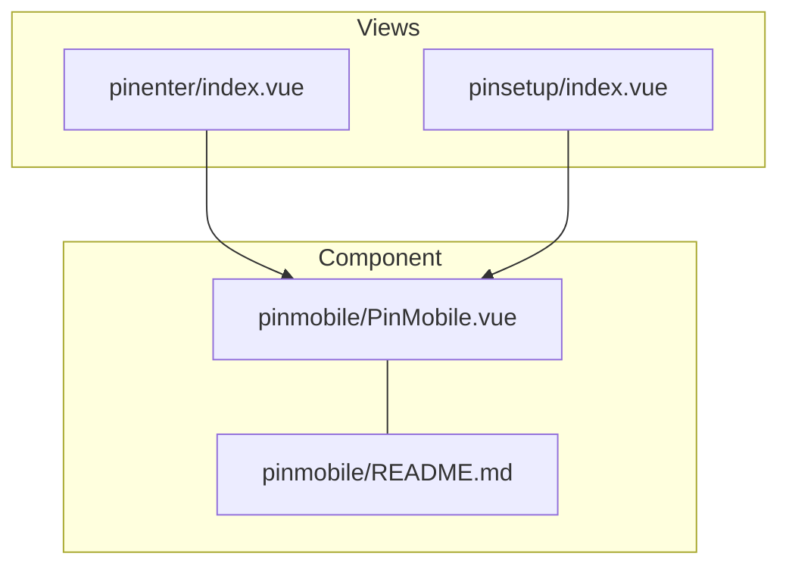
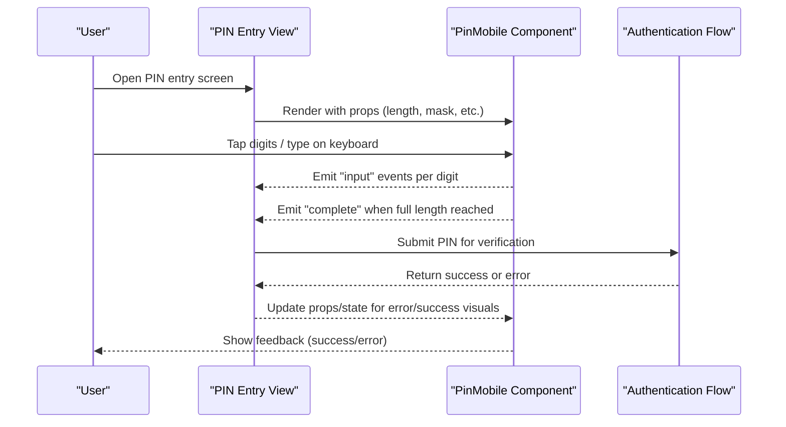
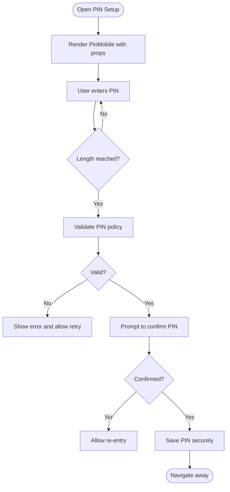
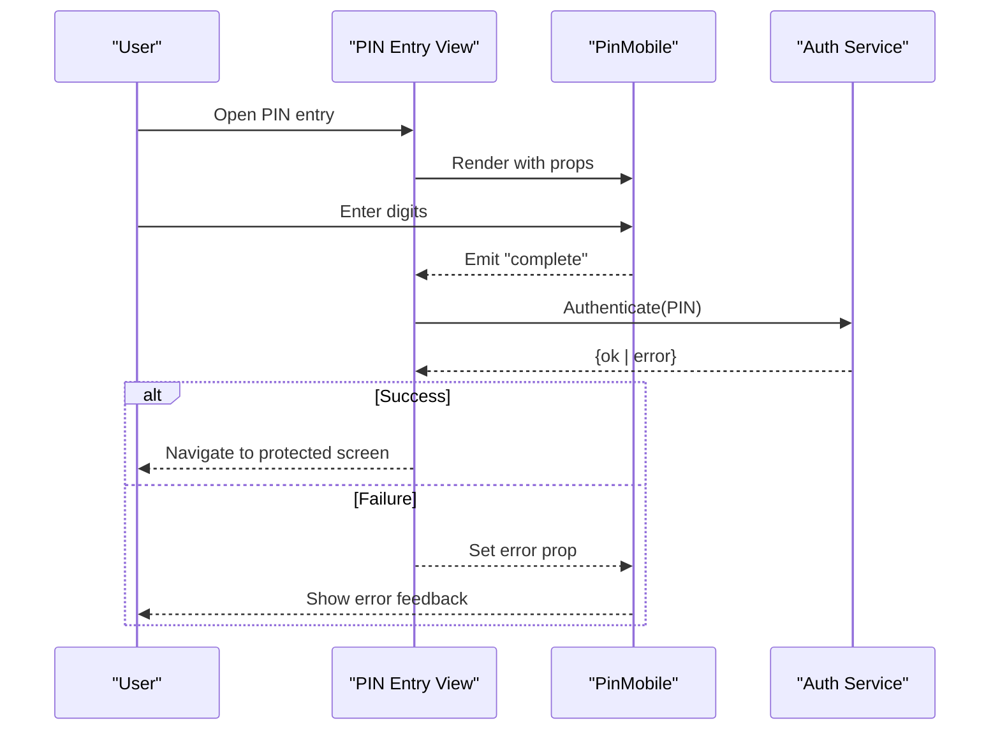
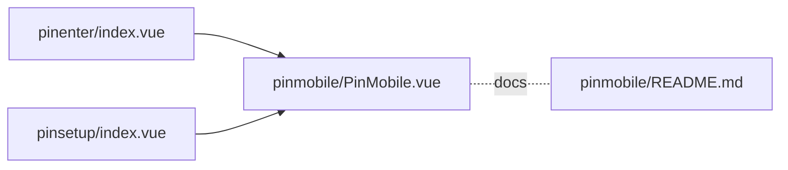

# PIN Input Component

<cite>
**Referenced Files in This Document**
- [PinMobile.vue](file://src/components/pinmobile/PinMobile.vue)
- [README.md](file://src/components/pinmobile/README.md)
- [index.vue](file://src/views/pinenter/index.vue)
- [index.vue](file://src/views/pinsetup/index.vue)
</cite>

## Table of Contents
1. [Introduction](#introduction)
2. [Project Structure](#project-structure)
3. [Core Components](#core-components)
4. [Architecture Overview](#architecture-overview)
5. [Detailed Component Analysis](#detailed-component-analysis)
6. [Dependency Analysis](#dependency-analysis)
7. [Performance Considerations](#performance-considerations)
8. [Troubleshooting Guide](#troubleshooting-guide)
9. [Conclusion](#conclusion)
10. [Appendices](#appendices)

## Introduction
This document provides comprehensive documentation for the PIN input mobile component used across the application. It covers props for PIN length validation, input masking, and error handling; explains the mobile-optimized interface design and touch interactions; includes usage examples for PIN entry workflows, validation rules, and error states; documents accessibility features, keyboard support, and cross-browser compatibility; and provides guidance on styling customization, animation effects, and integration with authentication flows. It also outlines how to extend the component for different PIN formats or validation requirements.

## Project Structure
The PIN input functionality is implemented as a reusable Vue component and consumed by dedicated views for PIN setup and PIN entry. The relevant files are:
- Reusable component: src/components/pinmobile/PinMobile.vue
- Component documentation: src/components/pinmobile/README.md
- PIN entry view: src/views/pinenter/index.vue
- PIN setup view: src/views/pinsetup/index.vue

**Diagram sources**
- [PinMobile.vue](file://src/components/pinmobile/PinMobile.vue)
- [README.md](file://src/components/pinmobile/README.md)
- [index.vue](file://src/views/pinenter/index.vue)
- [index.vue](file://src/views/pinsetup/index.vue)

**Section sources**
- [PinMobile.vue](file://src/components/pinmobile/PinMobile.vue)
- [README.md](file://src/components/pinmobile/README.md)
- [index.vue](file://src/views/pinenter/index.vue)
- [index.vue](file://src/views/pinsetup/index.vue)

## Core Components
The core of the feature is the PinMobile component, which encapsulates:
- PIN length configuration and validation
- Input masking behavior (e.g., numeric-only, masked display)
- Error state management and feedback
- Mobile-friendly UX patterns (large tap targets, auto-focus, clear affordances)
- Accessibility attributes and keyboard navigation
- Styling hooks for customization

Consuming views integrate this component into their flows:
- PIN setup flow: guides users through creating a new PIN
- PIN entry flow: prompts users to enter an existing PIN for authentication

Key responsibilities:
- Validate input against configured length and format constraints
- Emit events when the PIN is complete or changes
- Surface errors and assistive messages
- Provide visual and interactive feedback for user actions

**Section sources**
- [PinMobile.vue](file://src/components/pinmobile/PinMobile.vue)
- [README.md](file://src/components/pinmobile/README.md)
- [index.vue](file://src/views/pinenter/index.vue)
- [index.vue](file://src/views/pinsetup/index.vue)

## Architecture Overview
At a high level, the PIN input component is a self-contained UI module that integrates with parent views via props and events. Parent views handle business logic such as persistence, authentication calls, and navigation.

**Diagram sources**
- [index.vue](file://src/views/pinenter/index.vue)
- [PinMobile.vue](file://src/components/pinmobile/PinMobile.vue)

## Detailed Component Analysis

### Props API
Typical props exposed by the component include:
- length: Number of digits expected
- mask: Boolean or string to control masking behavior
- disabled: Whether the input is locked
- placeholder: Text shown before any input
- autofocus: Whether to focus the input on mount
- error: External error message or flag
- success: Success indicator
- ariaLabel: Accessible label for assistive technologies
- customStyles: Object or class names for styling overrides

Notes:
- Use length to enforce exact digit count and trigger completion.
- Use mask to hide sensitive characters while typing.
- Use error and success to reflect external validation results.

**Section sources**
- [PinMobile.vue](file://src/components/pinmobile/PinMobile.vue)
- [README.md](file://src/components/pinmobile/README.md)

### Events and Emits
Common events emitted by the component:
- input: Emitted with each digit change
- complete: Emitted when the PIN reaches the configured length
- error: Emitted when internal validation fails (e.g., invalid characters)
- focus/blur: For lifecycle tracking if needed

Parent views should listen to these events to drive workflows and update UI state.

**Section sources**
- [PinMobile.vue](file://src/components/pinmobile/PinMobile.vue)

### Validation Rules
Validation typically includes:
- Numeric-only enforcement
- Exact length matching
- Optional pattern checks (e.g., no repeated digits)
- Clear error messaging tied to the error prop

When validation fails, the component should surface accessible error text and visual cues.

**Section sources**
- [PinMobile.vue](file://src/components/pinmobile/PinMobile.vue)

### Mobile-Optimized Interface Design
Design considerations:
- Large, tappable digit buttons
- Immediate visual feedback on press
- Auto-focus on mount for faster entry
- Backspace handling via soft keyboard and on-screen controls
- Haptic feedback where supported
- Responsive layout for various screen sizes

These behaviors improve usability on touch devices and reduce cognitive load during PIN entry.

**Section sources**
- [PinMobile.vue](file://src/components/pinmobile/PinMobile.vue)

### Touch Interactions
Touch interaction patterns:
- Single-tap to insert digits
- Long-press or dedicated backspace button to delete
- Swipe gestures optional for advanced UX
- Prevent accidental zoom and double-tap issues

Ensure event listeners are optimized for mobile performance and avoid unnecessary re-renders.

**Section sources**
- [PinMobile.vue](file://src/components/pinmobile/PinMobile.vue)

### Accessibility Features
Accessibility enhancements:
- Proper role and aria-label attributes
- Live region announcements for errors and success
- Focus management and visible focus indicators
- Keyboard navigation support (arrow keys, Enter, Backspace)
- High contrast and scalable text support

These features ensure the component is usable by people relying on assistive technologies.

**Section sources**
- [PinMobile.vue](file://src/components/pinmobile/PinMobile.vue)

### Keyboard Support
Keyboard behaviors:
- Accept numeric keystrokes only
- Backspace removes last digit
- Enter submits when complete
- Tab order aligns with logical flow
- Escape clears input if appropriate

Consistent keyboard support improves efficiency for desktop and hybrid devices.

**Section sources**
- [PinMobile.vue](file://src/components/pinmobile/PinMobile.vue)

### Cross-Browser Compatibility
Compatibility considerations:
- Consistent behavior across iOS Safari, Android Chrome, and modern browsers
- Handling of virtual keyboards and autocorrect settings
- Avoiding browser-specific quirks in input modes and masks
- Testing on multiple device orientations and densities

**Section sources**
- [PinMobile.vue](file://src/components/pinmobile/PinMobile.vue)

### Styling Customization
Styling hooks:
- CSS classes for slots (digit container, active digit, error state)
- Custom style overrides via props or scoped styles
- Theme variables for colors, spacing, and typography
- Animation classes for transitions and micro-interactions

Use these hooks to match app-wide design systems and brand guidelines.

**Section sources**
- [PinMobile.vue](file://src/components/pinmobile/PinMobile.vue)

### Animation Effects
Animation suggestions:
- Subtle scale or color transition on digit entry
- Shake or highlight on error
- Fade-in for success confirmation
- Smooth focus transitions

Keep animations short and non-blocking to maintain responsiveness.

**Section sources**
- [PinMobile.vue](file://src/components/pinmobile/PinMobile.vue)

### Integration with Authentication Flows
Integration points:
- Listen to complete event to submit PIN to backend
- Handle success and error responses by updating component props
- Persist session state after successful authentication
- Provide retry and reset options on failure

Coordinate with routing to navigate to protected screens upon success.

**Section sources**
- [index.vue](file://src/views/pinenter/index.vue)
- [PinMobile.vue](file://src/components/pinmobile/PinMobile.vue)

### Usage Examples

#### PIN Setup Workflow
Steps:
- Navigate to PIN setup view
- Render PinMobile with desired length and mask
- On complete, validate against server or local policy
- Confirm PIN by re-entering if required
- Save and navigate to next step

**Diagram sources**
- [index.vue](file://src/views/pinsetup/index.vue)
- [PinMobile.vue](file://src/components/pinmobile/PinMobile.vue)

**Section sources**
- [index.vue](file://src/views/pinsetup/index.vue)
- [PinMobile.vue](file://src/components/pinmobile/PinMobile.vue)

#### PIN Entry Workflow
Steps:
- Navigate to PIN entry view
- Render PinMobile with length and mask
- On complete, send PIN to authentication service
- Handle success by navigating to protected content
- Handle failure by showing error and allowing retry

**Diagram sources**
- [index.vue](file://src/views/pinenter/index.vue)
- [PinMobile.vue](file://src/components/pinmobile/PinMobile.vue)

**Section sources**
- [index.vue](file://src/views/pinenter/index.vue)
- [PinMobile.vue](file://src/components/pinmobile/PinMobile.vue)

### Extending the Component
Guidelines for extension:
- Add new validation rules via props or config objects
- Support alternative PIN formats (alphanumeric, mixed case)
- Integrate additional biometric prompts or multi-factor steps
- Provide theme variants through style hooks
- Expose more granular events for analytics and logging

Ensure backward compatibility by keeping existing props and events stable.

**Section sources**
- [PinMobile.vue](file://src/components/pinmobile/PinMobile.vue)
- [README.md](file://src/components/pinmobile/README.md)

## Dependency Analysis
The PIN entry and setup views depend on the PinMobile component. The component itself may rely on internal utilities for validation and accessibility but remains decoupled from business logic.

**Diagram sources**
- [index.vue](file://src/views/pinenter/index.vue)
- [index.vue](file://src/views/pinsetup/index.vue)
- [PinMobile.vue](file://src/components/pinmobile/PinMobile.vue)
- [README.md](file://src/components/pinmobile/README.md)

**Section sources**
- [index.vue](file://src/views/pinenter/index.vue)
- [index.vue](file://src/views/pinsetup/index.vue)
- [PinMobile.vue](file://src/components/pinmobile/PinMobile.vue)
- [README.md](file://src/components/pinmobile/README.md)

## Performance Considerations
- Minimize re-renders by emitting precise events and avoiding heavy computations in render paths
- Debounce or throttle network calls triggered by PIN submission
- Use efficient event listeners for touch and keyboard inputs
- Keep animations lightweight and GPU-accelerated where possible
- Test on low-end devices to ensure smooth interactions

[No sources needed since this section provides general guidance]

## Troubleshooting Guide
Common issues and resolutions:
- Input not focusing automatically: Ensure autofocus prop is set and no modal overlays block focus
- Mask not applied: Verify mask prop value and platform-specific input mode settings
- Errors not displayed: Check error prop binding and live region announcements
- Keyboard conflicts: Disable autocorrect and predictive text for numeric-only inputs
- Cross-browser inconsistencies: Normalize input handling and test on target platforms

If problems persist, review console logs and inspect DOM attributes related to accessibility and focus management.

**Section sources**
- [PinMobile.vue](file://src/components/pinmobile/PinMobile.vue)
- [README.md](file://src/components/pinmobile/README.md)

## Conclusion
The PIN input mobile component provides a robust, accessible, and customizable solution for secure PIN entry and setup workflows. By leveraging its props, events, and styling hooks, developers can integrate it seamlessly into authentication flows while maintaining a consistent, mobile-first user experience. Extensibility guidelines enable adaptation to diverse PIN formats and organizational policies without compromising stability.

[No sources needed since this section summarizes without analyzing specific files]

## Appendices

### Quick Reference: Props, Events, and Slots
- Props: length, mask, disabled, placeholder, autofocus, error, success, ariaLabel, customStyles
- Events: input, complete, error, focus, blur
- Slots: digit, backspace, error-message (if applicable)

For detailed descriptions and defaults, consult the component’s README and source file.

**Section sources**
- [README.md](file://src/components/pinmobile/README.md)
- [PinMobile.vue](file://src/components/pinmobile/PinMobile.vue)