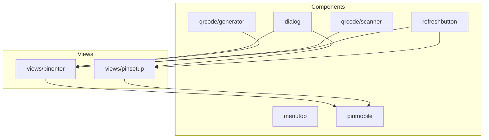
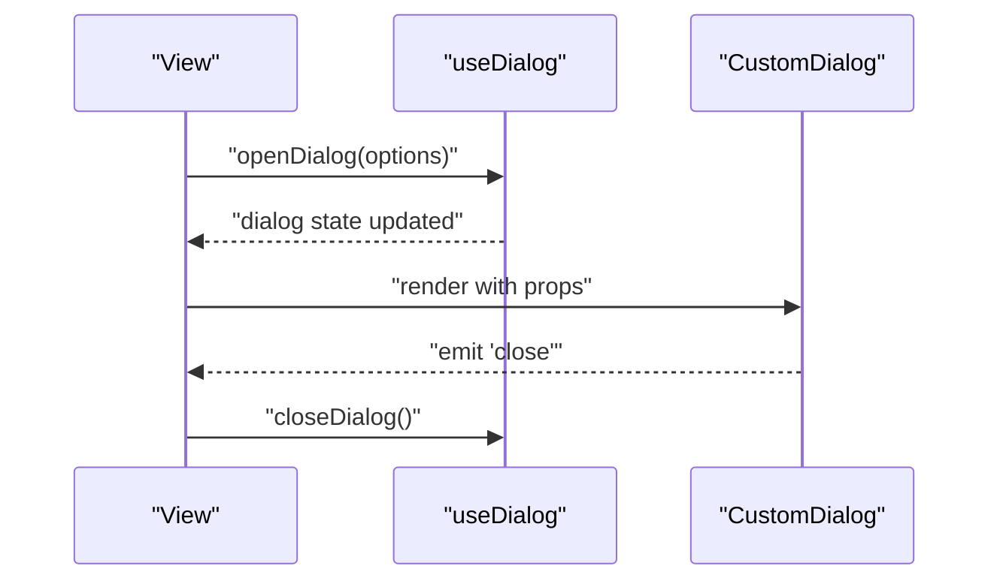
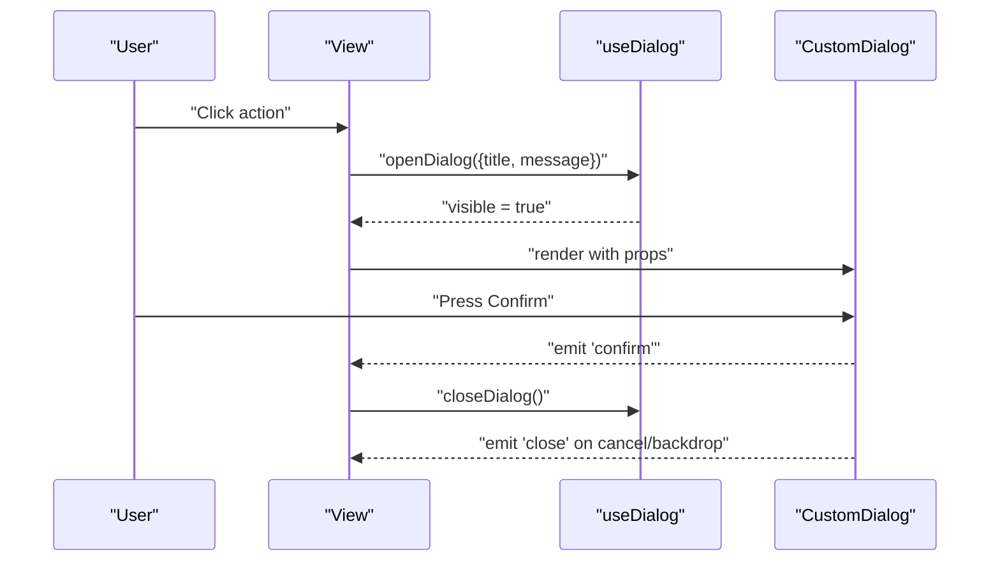
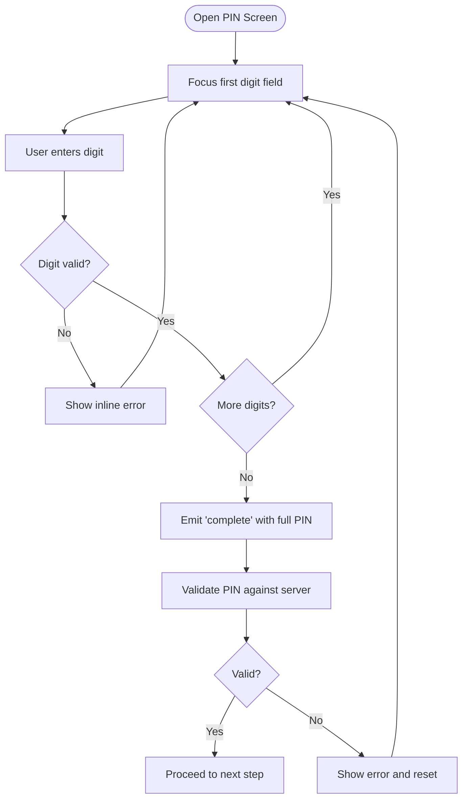
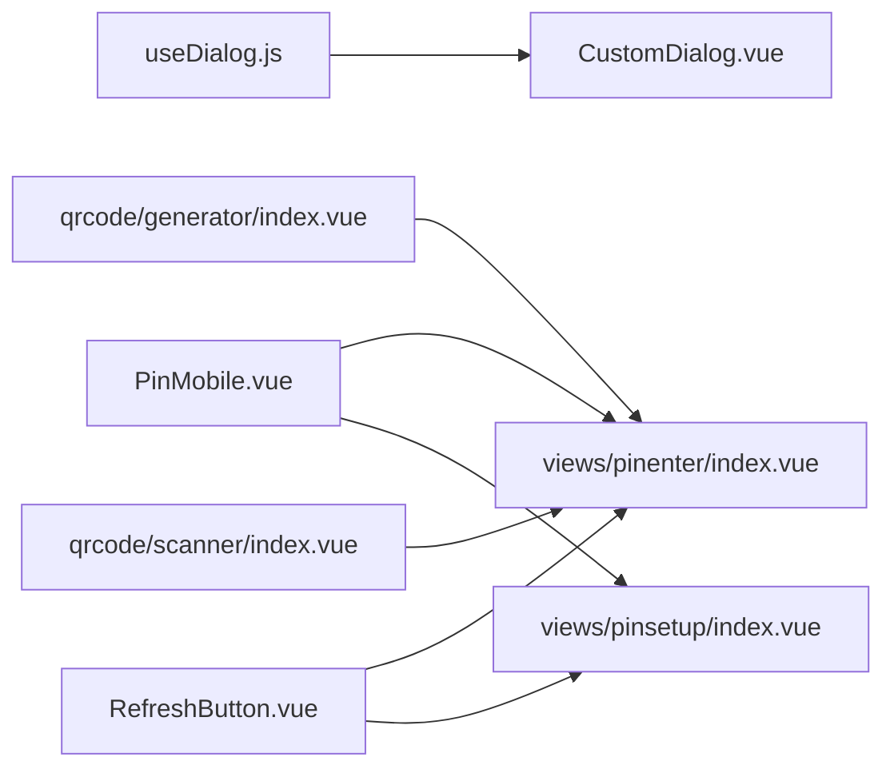

# UI Components

<cite>
**Referenced Files in This Document**
- [CustomDialog.vue](file://src/components/dialog/CustomDialog.vue)
- [useDialog.js](file://src/components/dialog/useDialog.js)
- [README.md](file://src/components/dialog/README.md)
- [index.vue](file://src/components/menutop/index.vue)
- [PinMobile.vue](file://src/components/pinmobile/PinMobile.vue)
- [README.md](file://src/components/pinmobile/README.md)
- [index.vue](file://src/components/qrcode/generator/index.vue)
- [index.vue](file://src/components/qrcode/scanner/index.vue)
- [RefreshButton.vue](file://src/components/refreshbutton/RefreshButton.vue)
- [README.md](file://src/components/refreshbutton/README.md)
- [pinenter/index.vue](file://src/views/pinenter/index.vue)
- [pinsetup/index.vue](file://src/views/pinsetup/index.vue)
</cite>

## Table of Contents
1. [Introduction](#introduction)
2. [Project Structure](#project-structure)
3. [Core Components](#core-components)
4. [Architecture Overview](#architecture-overview)
5. [Detailed Component Analysis](#detailed-component-analysis)
6. [Dependency Analysis](#dependency-analysis)
7. [Performance Considerations](#performance-considerations)
8. [Troubleshooting Guide](#troubleshooting-guide)
9. [Conclusion](#conclusion)
10. [Appendices](#appendices)

## Introduction
This document describes the reusable UI components in the ahm-gr-scanner application, focusing on the dialog system, menu bar, PIN input interface, QR code generation and scanning utilities, and a refresh button. It explains props, events, slots, customization options, composition patterns, styling approaches, responsive behavior, accessibility features, cross-browser compatibility, and performance considerations. It also provides guidelines for extending existing components and creating new ones following established patterns.

## Project Structure
The UI components are organized under src/components with feature-based directories:
- Dialog system: src/components/dialog
- Menu top bar: src/components/menutop
- PIN mobile input: src/components/pinmobile
- QR code generator and scanner: src/components/qrcode
- Refresh button: src/components/refreshbutton

[No sources needed since this diagram shows conceptual structure]

## Core Components
- Dialog System: A composable dialog API with a reusable modal component and a JavaScript hook to open/close dialogs programmatically.
- Menu Top Bar: A simple top-level navigation/menu container used across views.
- PIN Mobile Input: A numeric PIN entry interface designed for mobile devices with keyboard handling and validation.
- QR Code Generator: A utility component that renders a QR code from provided data.
- QR Code Scanner: A camera-based scanner component that decodes QR/barcode content.
- Refresh Button: A small action button to trigger data refresh operations.

Key responsibilities:
- Encapsulate complex interactions (e.g., dialog lifecycle, PIN input flow).
- Provide clear APIs (props, events, slots) for reuse.
- Offer consistent styling and accessibility behaviors.

**Section sources**
- [CustomDialog.vue](file://src/components/dialog/CustomDialog.vue)
- [useDialog.js](file://src/components/dialog/useDialog.js)
- [README.md](file://src/components/dialog/README.md)
- [index.vue](file://src/components/menutop/index.vue)
- [PinMobile.vue](file://src/components/pinmobile/PinMobile.vue)
- [README.md](file://src/components/pinmobile/README.md)
- [index.vue](file://src/components/qrcode/generator/index.vue)
- [index.vue](file://src/components/qrcode/scanner/index.vue)
- [RefreshButton.vue](file://src/components/refreshbutton/RefreshButton.vue)
- [README.md](file://src/components/refreshbutton/README.md)

## Architecture Overview
The dialog system is composed of a Vue component and a composable hook. Views consume the hook to control dialog state and render the dialog component where appropriate. The PIN input component integrates with views for authentication flows. QR utilities provide both generation and scanning capabilities.

**Diagram sources**
- [useDialog.js](file://src/components/dialog/useDialog.js)
- [CustomDialog.vue](file://src/components/dialog/CustomDialog.vue)

## Detailed Component Analysis

### Dialog System
The dialog system consists of:
- CustomDialog.vue: The modal component responsible for rendering overlay, title, body, and actions.
- useDialog.js: A composable that manages dialog visibility and configuration.

Props (typical):
- title: string
- message or content: string or slot
- confirmText: string
- cancelText: string
- showConfirm: boolean
- showCancel: boolean
- width: number or string
- closable: boolean

Events:
- close: emitted when user dismisses via cancel, backdrop click, or explicit close
- confirm: emitted when user confirms

Slots:
- default: main content area
- footer: custom action buttons

Usage pattern:
- Use the composable to open/close dialogs from any view.
- Render the dialog component once at the app root or within a layout.
- Pass dynamic content via props or slots.

Accessibility:
- Focus management on open/close
- Escape key support
- ARIA roles and labels for modal and buttons

Styling:
- Overlay backdrop with z-index layering
- Responsive width constraints
- Keyboard focus outlines

Cross-browser:
- Uses standard modal semantics and CSS overlays
- Avoids non-standard APIs

Performance:
- Lazy render content if large
- Debounce rapid open/close calls

Extensibility:
- Create specialized dialogs by wrapping the base dialog with preconfigured props/slots
- Extend the composable to add confirmation variants

**Section sources**
- [CustomDialog.vue](file://src/components/dialog/CustomDialog.vue)
- [useDialog.js](file://src/components/dialog/useDialog.js)
- [README.md](file://src/components/dialog/README.md)

#### Dialog Sequence Diagram

**Diagram sources**
- [useDialog.js](file://src/components/dialog/useDialog.js)
- [CustomDialog.vue](file://src/components/dialog/CustomDialog.vue)

### Menu Top Bar
A lightweight top-level menu container used to organize navigation items and actions.

Props:
- items: array of menu entries
- activeIndex: number or string
- compact: boolean

Events:
- select: emitted with selected item payload

Slots:
- default: custom menu items
- extra: additional controls (e.g., profile, settings)

Styling:
- Horizontal layout with responsive collapse on small screens
- Focus indicators for keyboard navigation

Responsive behavior:
- Collapses into a hamburger or dropdown on narrow widths

Accessibility:
- Role="navigation"
- aria-current for active item
- Keyboard arrow navigation

**Section sources**
- [index.vue](file://src/components/menutop/index.vue)

### PIN Mobile Input
A mobile-friendly numeric PIN entry component with validation and error feedback.

Props:
- length: number (default digits)
- value: string or number
- disabled: boolean
- placeholder: string
- autofocus: boolean
- mask: boolean (show dots instead of digits)

Events:
- input: emits current value
- complete: emits when all digits entered
- error: emits validation errors

Slots:
- label: accessible label text
- helper: helper text or instructions
- error: custom error messages

Behavior:
- Numeric-only input
- Auto-focus and auto-advance between fields
- Clear and backspace handling
- Optional masking for privacy

Accessibility:
- Associated label via aria-labelledby or aria-label
- Live region updates for errors
- High contrast focus states

Cross-browser:
- Uses native input type="tel" and pattern attributes
- Graceful fallback for older browsers

Performance:
- Minimal re-renders using controlled value
- Debounced validation if needed

**Section sources**
- [PinMobile.vue](file://src/components/pinmobile/PinMobile.vue)
- [README.md](file://src/components/pinmobile/README.md)

#### PIN Input Flowchart

**Diagram sources**
- [PinMobile.vue](file://src/components/pinmobile/PinMobile.vue)
- [pinenter/index.vue](file://src/views/pinenter/index.vue)
- [pinsetup/index.vue](file://src/views/pinsetup/index.vue)

### QR Code Generator
Generates a QR code image or canvas from provided data.

Props:
- data: string or object
- size: number
- color: string
- bgColor: string
- format: string ("canvas" | "image")

Events:
- ready: emitted when QR is generated
- error: emitted on generation failure

Slots:
- fallback: rendered when generation fails

Styling:
- Responsive sizing via CSS variables
- Centered alignment

Accessibility:
- alt text for images
- role="img" for canvas

Cross-browser:
- Uses standard canvas/image APIs
- Fallback to image if canvas unsupported

Performance:
- Memoize QR generation for identical inputs
- Defer generation until visible

**Section sources**
- [index.vue](file://src/components/qrcode/generator/index.vue)

### QR Code Scanner
Scans QR codes and barcodes using device cameras.

Props:
- formats: array of supported formats
- facingMode: string ("user" | "environment")
- onError: function callback
- onScan: function callback

Events:
- scan: emitted with decoded result
- error: emitted on camera or decoding errors

Slots:
- preview: custom camera preview overlay
- notFound: message when no camera available

Behavior:
- Requests camera permissions
- Handles permission denials gracefully
- Stops stream on unmount

Accessibility:
- Announces scanning status via live regions
- Provides manual input fallback

Cross-browser:
- Uses MediaDevices API with polyfills where necessary
- Falls back to file upload if camera unavailable

Performance:
- Throttles decode frames
- Releases camera resources promptly

**Section sources**
- [index.vue](file://src/components/qrcode/scanner/index.vue)

### Refresh Button
A small action button to trigger refresh operations.

Props:
- loading: boolean
- disabled: boolean
- icon: string or slot
- tooltip: string

Events:
- click: emitted on press

Slots:
- default: custom icon or label

Styling:
- Compact design with hover/focus states
- Spinner animation while loading

Accessibility:
- aria-label for screen readers
- aria-busy during loading

Cross-browser:
- Standard button element with CSS animations

Performance:
- Prevents multiple concurrent requests via loading flag

**Section sources**
- [RefreshButton.vue](file://src/components/refreshbutton/RefreshButton.vue)
- [README.md](file://src/components/refreshbutton/README.md)

## Dependency Analysis
Component relationships:
- Dialog system: useDialog.js orchestrates state; CustomDialog.vue renders UI.
- PIN input: PinMobile.vue is consumed by pinenter and pinsetup views.
- QR utilities: generator and scanner are independent but may be used together in workflows.
- Refresh button: used across views to trigger data reloads.

**Diagram sources**
- [useDialog.js](file://src/components/dialog/useDialog.js)
- [CustomDialog.vue](file://src/components/dialog/CustomDialog.vue)
- [PinMobile.vue](file://src/components/pinmobile/PinMobile.vue)
- [index.vue](file://src/components/qrcode/generator/index.vue)
- [index.vue](file://src/components/qrcode/scanner/index.vue)
- [RefreshButton.vue](file://src/components/refreshbutton/RefreshButton.vue)
- [pinenter/index.vue](file://src/views/pinenter/index.vue)
- [pinsetup/index.vue](file://src/views/pinsetup/index.vue)

**Section sources**
- [useDialog.js](file://src/components/dialog/useDialog.js)
- [CustomDialog.vue](file://src/components/dialog/CustomDialog.vue)
- [PinMobile.vue](file://src/components/pinmobile/PinMobile.vue)
- [index.vue](file://src/components/qrcode/generator/index.vue)
- [index.vue](file://src/components/qrcode/scanner/index.vue)
- [RefreshButton.vue](file://src/components/refreshbutton/RefreshButton.vue)
- [pinenter/index.vue](file://src/views/pinenter/index.vue)
- [pinsetup/index.vue](file://src/views/pinsetup/index.vue)

## Performance Considerations
- Dialog:
  - Render only when visible
  - Avoid heavy computations in template
  - Use memoization for static content
- PIN Input:
  - Controlled input with minimal reactivity overhead
  - Debounce validation if server-side checks are involved
- QR Generator:
  - Cache results keyed by input data
  - Generate offscreen when possible
- QR Scanner:
  - Limit frame rate for decoding
  - Stop media stream on unmount
- Refresh Button:
  - Guard against duplicate requests
  - Show loading state to prevent repeated clicks

[No sources needed since this section provides general guidance]

## Troubleshooting Guide
Common issues and resolutions:
- Dialog does not close:
  - Ensure close event is handled and state is updated
  - Verify backdrop click handler is bound
- PIN input not accepting digits:
  - Check input mode and pattern attributes
  - Confirm autofocus and focus management
- QR scanner permission denied:
  - Handle permission errors and offer manual input fallback
  - Ensure HTTPS context for camera access
- QR generator blank:
  - Validate input data format
  - Check canvas/image fallback logic
- Refresh button not responding:
  - Inspect loading state and click handlers
  - Ensure network request completes and resets loading

**Section sources**
- [CustomDialog.vue](file://src/components/dialog/CustomDialog.vue)
- [PinMobile.vue](file://src/components/pinmobile/PinMobile.vue)
- [index.vue](file://src/components/qrcode/scanner/index.vue)
- [index.vue](file://src/components/qrcode/generator/index.vue)
- [RefreshButton.vue](file://src/components/refreshbutton/RefreshButton.vue)

## Conclusion
The ahm-gr-scanner UI components provide a cohesive set of reusable building blocks for dialogs, menus, PIN input, QR utilities, and refresh actions. They follow consistent APIs, emphasize accessibility and responsiveness, and include practical patterns for extension and customization. By adhering to the documented props, events, slots, and best practices, developers can compose robust and maintainable interfaces.

[No sources needed since this section summarizes without analyzing specific files]

## Appendices

### Usage Examples and Patterns
- Dialog usage:
  - Open via composable with title and message
  - Render dialog component with slots for rich content
  - Handle confirm and close events to update application state
- PIN input usage:
  - Bind value and listen for complete event
  - Display helper and error messages via slots
  - Integrate with authentication flows in views
- QR generator usage:
  - Pass data and size props
  - Listen for ready and error events
  - Provide fallback slot for unsupported environments
- QR scanner usage:
  - Configure formats and facing mode
  - Handle scan and error events
  - Provide preview and notFound slots
- Refresh button usage:
  - Toggle loading state around async operations
  - Provide tooltip and icon customization

[No sources needed since this section provides general guidance]

### Extending Existing Components
- Add new props with defaults and validation
- Emit standardized events for consistency
- Support slots for flexible content injection
- Maintain accessibility attributes and keyboard navigation
- Document changes in README files

[No sources needed since this section provides general guidance]