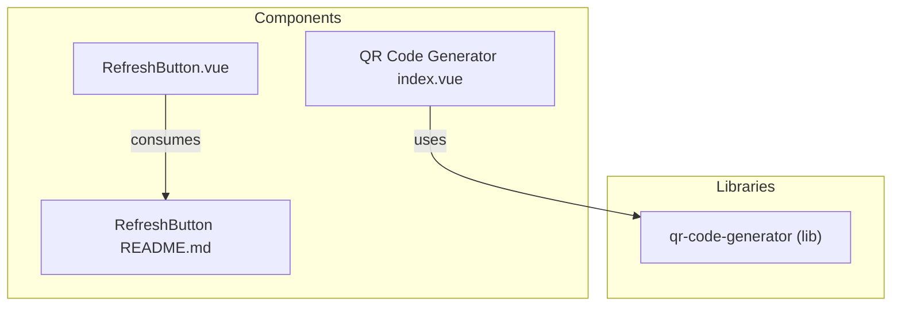
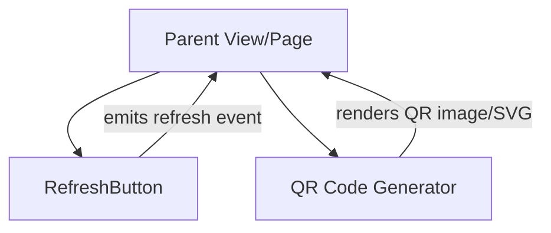
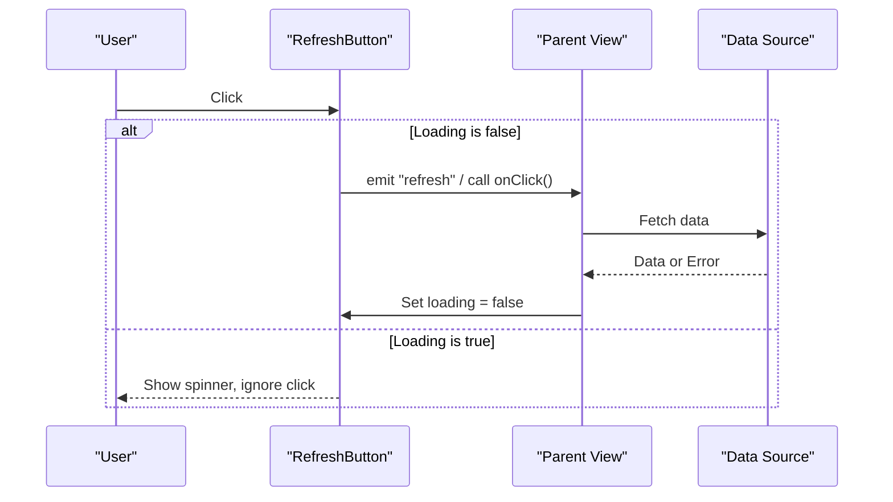
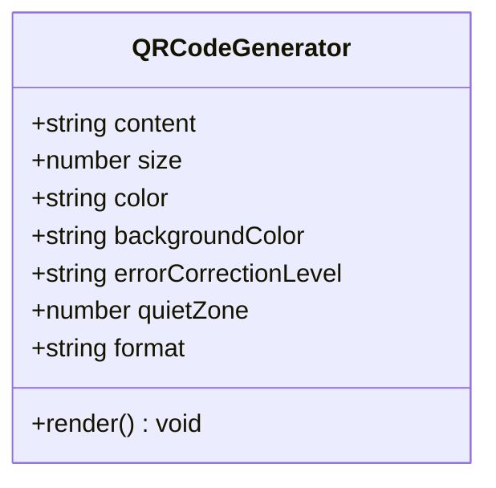
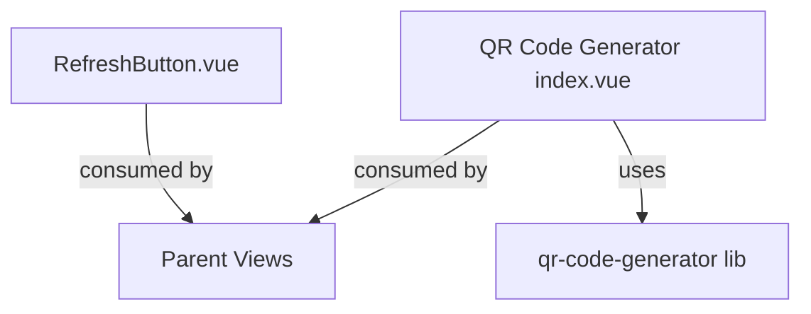

# Utility Components

<cite>
**Referenced Files in This Document**
- [RefreshButton.vue](file://src/components/refreshbutton/RefreshButton.vue)
- [README.md](file://src/components/refreshbutton/README.md)
- [index.vue](file://src/components/qrcode/generator/index.vue)
</cite>

## Table of Contents
1. [Introduction](#introduction)
2. [Project Structure](#project-structure)
3. [Core Components](#core-components)
4. [Architecture Overview](#architecture-overview)
5. [Detailed Component Analysis](#detailed-component-analysis)
6. [Dependency Analysis](#dependency-analysis)
7. [Performance Considerations](#performance-considerations)
8. [Troubleshooting Guide](#troubleshooting-guide)
9. [Conclusion](#conclusion)
10. [Appendices](#appendices)

## Introduction
This document provides detailed documentation for two utility components: the RefreshButton and the QR code generator. It covers props, configuration options, output formats, styling capabilities, usage examples, performance optimization techniques, accessibility features, responsive behavior, customization options, and best practices for mobile-first applications. The goal is to help developers integrate these components effectively into data fetching workflows and UIs that prioritize usability on small screens.

## Project Structure
The relevant source files are organized under src/components:
- RefreshButton component and its README
- QR code generator component

**Diagram sources**
- [RefreshButton.vue](file://src/components/refreshbutton/RefreshButton.vue)
- [README.md](file://src/components/refreshbutton/README.md)
- [index.vue](file://src/components/qrcode/generator/index.vue)

**Section sources**
- [RefreshButton.vue](file://src/components/refreshbutton/RefreshButton.vue)
- [README.md](file://src/components/refreshbutton/README.md)
- [index.vue](file://src/components/qrcode/generator/index.vue)

## Core Components
- RefreshButton: A button that indicates loading state and triggers a refresh action. It supports custom icons and click handlers.
- QR Code Generator: A component that renders QR codes with configurable options, output formats, and styling.

Key responsibilities:
- RefreshButton exposes props for loading states, icon customization, and event handling.
- QR Code Generator accepts configuration for content, size, color, error correction, and output format.

**Section sources**
- [RefreshButton.vue](file://src/components/refreshbutton/RefreshButton.vue)
- [README.md](file://src/components/refreshbutton/README.md)
- [index.vue](file://src/components/qrcode/generator/index.vue)

## Architecture Overview
High-level integration points:
- Parent views or pages consume RefreshButton to trigger data reloads and display loading feedback.
- Parent views or pages use the QR code generator to render QR images from configured data.

[No sources needed since this diagram shows conceptual workflow, not actual code structure]

## Detailed Component Analysis

### RefreshButton Component
Purpose:
- Provide a compact control to refresh data with clear loading feedback.
- Allow customization via props for icons and labels.
- Emit events to notify parent components of user interactions.

Props:
- loading: Boolean indicating whether an asynchronous operation is in progress. When true, the button should visually indicate a loading state (e.g., spinner).
- icon: Optional prop to supply a custom icon element or string identifier. If provided, it replaces the default icon.
- onClick: Optional callback invoked when the button is clicked. Useful for triggering data fetches.

Behavior:
- When loading is true, disable further clicks and show a loading indicator.
- When loading is false, enable clicking and optionally show a static icon.
- Emits a refresh event (or invokes onClick) to signal the parent to perform the refresh.

Accessibility:
- Ensure the button has an accessible label describing its purpose (e.g., “Refresh”).
- Announce loading state changes to assistive technologies using aria attributes.
- Maintain focus visibility for keyboard navigation.

Styling:
- Support CSS classes or inline styles for size, color, and spacing.
- Respect prefers-reduced-motion if available to minimize animations during loading.

Usage example patterns:
- Basic usage: Bind loading to a reactive variable and pass a handler that toggles loading while fetching data.
- Custom icon: Pass a custom icon component or SVG path via the icon prop.
- Event-driven: Use the emitted refresh event to call a function that updates local state and refetches data.

Integration with data fetching:
- Wrap async operations in try/catch to handle errors gracefully.
- Debounce rapid clicks by disabling the button while loading.
- Combine with optimistic UI updates where appropriate.

Mobile-first considerations:
- Ensure adequate touch target size (minimum recommended dimensions).
- Keep labels concise; rely on icons with tooltips or screen reader text.
- Avoid heavy animations that could impact performance on low-end devices.

**Section sources**
- [RefreshButton.vue](file://src/components/refreshbutton/RefreshButton.vue)
- [README.md](file://src/components/refreshbutton/README.md)

#### Sequence Diagram: Refresh Flow

**Diagram sources**
- [RefreshButton.vue](file://src/components/refreshbutton/RefreshButton.vue)

### QR Code Generator Component
Purpose:
- Render QR codes from input strings or structured data.
- Provide configuration for output format, styling, and error correction.

Configuration options:
- content: String or object to encode into the QR code.
- size: Numeric value controlling the rendered size (pixels or relative units depending on implementation).
- color: Foreground color of the QR code modules.
- backgroundColor: Background color behind the QR code.
- errorCorrectionLevel: Level of error correction (e.g., low, medium, quartile, high).
- quietZone: Padding around the QR code to improve scanning reliability.
- format: Output format such as canvas, svg, or image URL. Choose based on rendering needs.

Output formats:
- Canvas: Suitable for dynamic manipulation and rasterization.
- SVG: Scalable vector graphics ideal for crisp rendering at any size.
- Image URL: Base64-encoded or hosted image link for direct embedding.

Styling capabilities:
- Control module colors and background.
- Adjust quiet zone padding for better scanability.
- Apply container CSS for layout and responsiveness.

Accessibility:
- Provide descriptive alt text for generated images or SVGs.
- Include a human-readable fallback (e.g., hidden text) for screen readers when necessary.
- Ensure sufficient contrast between foreground and background colors.

Responsive behavior:
- Scale the QR code proportionally within its container.
- Use fluid sizing (e.g., percentage-based width) to adapt to different screen sizes.
- Test scanning across devices and orientations.

Usage example patterns:
- Static content: Bind a fixed string to the content prop and set size and colors.
- Dynamic content: Update content reactively when underlying data changes.
- Format selection: Choose SVG for crisp scaling or canvas for pixel-level control.

Integration with data fetching workflows:
- Generate QR codes after data loads successfully.
- Debounce frequent updates if content changes rapidly.
- Cache generated QR outputs to avoid redundant re-renders.

Best practices for mobile-first applications:
- Prefer SVG for scalability and clarity on high-DPI screens.
- Ensure minimum quiet zone to accommodate camera focusing limitations.
- Keep QR content concise to reduce complexity and improve scan speed.

**Section sources**
- [index.vue](file://src/components/qrcode/generator/index.vue)

#### Class Diagram: QR Code Generator Props

**Diagram sources**
- [index.vue](file://src/components/qrcode/generator/index.vue)

## Dependency Analysis
- RefreshButton depends on:
  - Parent view for loading state management and data fetching logic.
  - Optional icon resources passed via props.
- QR Code Generator depends on:
  - Internal library for encoding and rendering QR codes.
  - Parent view for configuration and lifecycle management.

**Diagram sources**
- [RefreshButton.vue](file://src/components/refreshbutton/RefreshButton.vue)
- [index.vue](file://src/components/qrcode/generator/index.vue)

**Section sources**
- [RefreshButton.vue](file://src/components/refreshbutton/RefreshButton.vue)
- [index.vue](file://src/components/qrcode/generator/index.vue)

## Performance Considerations
- RefreshButton:
  - Disable clicks during loading to prevent redundant requests.
  - Avoid heavy animations; prefer lightweight spinners.
  - Coalesce multiple refresh triggers using debouncing if needed.
- QR Code Generator:
  - Choose SVG for scalable rendering without re-rasterization.
  - Cache generated QR outputs keyed by content and configuration.
  - Limit frequent re-renders by memoizing computed values.
  - Optimize content length to reduce QR complexity.

[No sources needed since this section provides general guidance]

## Troubleshooting Guide
Common issues and resolutions:
- RefreshButton does not respond:
  - Verify loading state is false before allowing clicks.
  - Check that onClick or refresh event handler is bound correctly.
- QR code not scannable:
  - Increase quiet zone padding.
  - Ensure sufficient contrast between foreground and background colors.
  - Validate content length and character set compatibility.
- Accessibility concerns:
  - Confirm alt text or labels are present and meaningful.
  - Test with screen readers and keyboard navigation.

**Section sources**
- [RefreshButton.vue](file://src/components/refreshbutton/RefreshButton.vue)
- [index.vue](file://src/components/qrcode/generator/index.vue)

## Conclusion
The RefreshButton and QR code generator provide essential utilities for interactive data flows and visual encoding. By leveraging their props and configuration options, you can create accessible, responsive, and performant experiences tailored for mobile-first applications. Follow the best practices outlined here to ensure robust integration and optimal user experience.

[No sources needed since this section summarizes without analyzing specific files]

## Appendices
- Additional references:
  - RefreshButton README for usage notes and examples.
  - Library documentation for qr-code-generator for advanced configuration.

**Section sources**
- [README.md](file://src/components/refreshbutton/README.md)
- [index.vue](file://src/components/qrcode/generator/index.vue)